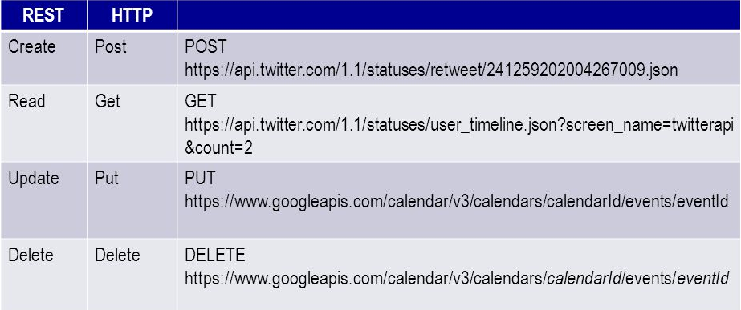
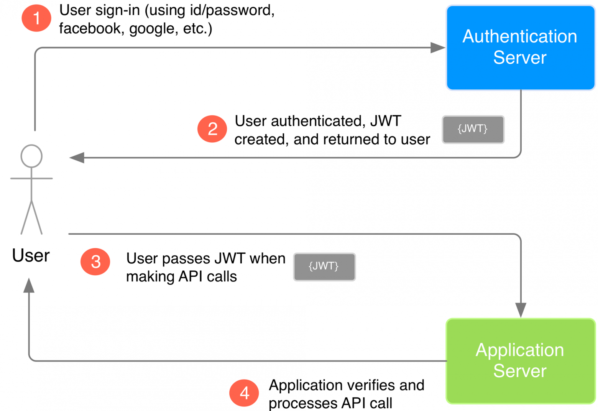
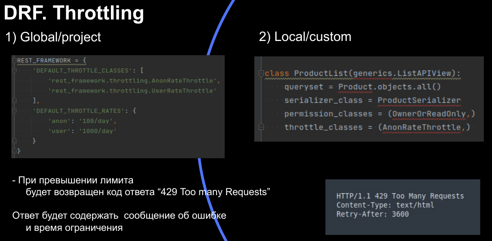

- [MVC](#org25a650b)
- [Зачем нужен DRF](#orgefa123e)
- [Зачем нужен DRF](#org83b4d15)
- [JWT](#org1b4cc2b)
- [Зачем нужен DRF](#orgd392d18)
- [Serializers](#org24bbd49)
- [Serializers. Валидация](#org699eb52)
- [Serializers. Default](#org9acfbdb)
- [ViewSet](#orge060534)
- [ViewSet. Ограничение на методы](#org58287cc)
- [ViewSet. create / performe\_create](#org9aac70d)
- [ViewSet. get\_serializer\_class](#orga548fc6)
- [Permissions](#orgf605bff)
- [Permissions](#orgbddd1b7)
- [Permissions](#orgaad1c3c)
- [Паджинация](#orga7e52b4)
- [Throttling](#org678a615)
- [Фильтрация](#org91fd50d)
- [Дополнительная литература](#org9c820cd)


<a id="org25a650b"></a>

# MVC

  


<a id="orgefa123e"></a>

# Зачем нужен DRF

-   CRUD

  


<a id="org83b4d15"></a>

# Зачем нужен DRF

-   Права доступа

  


<a id="org1b4cc2b"></a>

# JWT

  


<a id="orgd392d18"></a>

# Зачем нужен DRF

-   Сериализация

```python
import json
from django.db import Model


class MyModel(Model):
    ...
    def to_json(self):
        ...
```

Зачем тогда нужны сериализаторы?  


<a id="org24bbd49"></a>

# Serializers

-   JSON
-   XML
-   YAML
-   многие другие


<a id="org699eb52"></a>

# Serializers. Валидация

```python
def validate_<field>(self, field):
  if ...:
    raise serializers.ValidationError
  return field

def validate(self, items):
  return items
```


<a id="org9acfbdb"></a>

# Serializers. Default

```python
def perform_create(self, serializer):
    serializer.save(
        owner=self.request.user
    )
```

Это плохой стиль! Необходимо использовать:  

-   [CurrentUserDefault](https://www.django-rest-framework.org/api-guide/validators/#currentuserdefault)
-   [CreateOnlyDefault](https://www.django-rest-framework.org/api-guide/validators/#createonlydefault)


<a id="orge060534"></a>

# ViewSet

```python
class ModelViewSet(
        mixins.CreateModelMixin,
        mixins.RetrieveModelMixin,
        mixins.UpdateModelMixin,
        mixins.DestroyModelMixin,
        mixins.ListModelMixin,
        GenericViewSet
):
```


<a id="org58287cc"></a>

# ViewSet. Ограничение на методы

1.  Можно наследоваться не от *ModelViewSet*, а создать свой набор миксинов

```python
class SnippetsViewSet(
        mixins.CreateModelMixin,
        mixins.RetrieveModelMixin,
        mixins.ListModelMixin
):
```

1.  Можно использовать *http\_method\_names*

```python
class SnippetsViewSet(ModelViewSet):
    ...
    http_method_names = ["get", "post"]
```


<a id="org9aac70d"></a>

# ViewSet. create / performe\_create

```python
class CreateModelMixin:
  """
  Create a model instance.
  """
  def create(self, request, *a, **k):
     serializer = self.get_serializer(
       data=request.data)
     serializer.is_valid(
       raise_exception=True)
     self.perform_create(serializer)
     # ...

  def perform_create(self, serializer):
    serializer.save()
```


<a id="orga548fc6"></a>

# ViewSet. get\_serializer\_class

  


<a id="orgf605bff"></a>

# Permissions

  


<a id="orgbddd1b7"></a>

# Permissions

  


<a id="orgaad1c3c"></a>

# Permissions

  

-   [has\_permission](https://www.django-rest-framework.org/tutorial/4-authentication-and-permissions/#adding-required-permissions-to-views)
-   [has\_object\_permission](https://www.django-rest-framework.org/tutorial/4-authentication-and-permissions/#object-level-permissions)


<a id="orga7e52b4"></a>

# Паджинация

  


<a id="org678a615"></a>

# Throttling

  


<a id="org91fd50d"></a>

# Фильтрация

-   [Django-Filter](https://django-filter.readthedocs.io/en/stable/guide/usage.html) иногда бывает слишком громоздким решением для простой задачи

```python
def get_queryset(self):
  langs = (
    self.request.query_params
    .getlist('langs')
  )
  qs = Recipe.objects
  if tags:
    qs = qs.filter(language__in=langs)
  # if self.request.query_params.get(
  #     'is_favorited'):
  #   qs = qs.filter(is_favorited=True)
  return qs
```


<a id="org9c820cd"></a>

# Дополнительная литература

-   [JWT токен](https://habr.com/ru/articles/340146/)
-   [DRF Tutorial](https://www.django-rest-framework.org/tutorial/1-serialization/)
